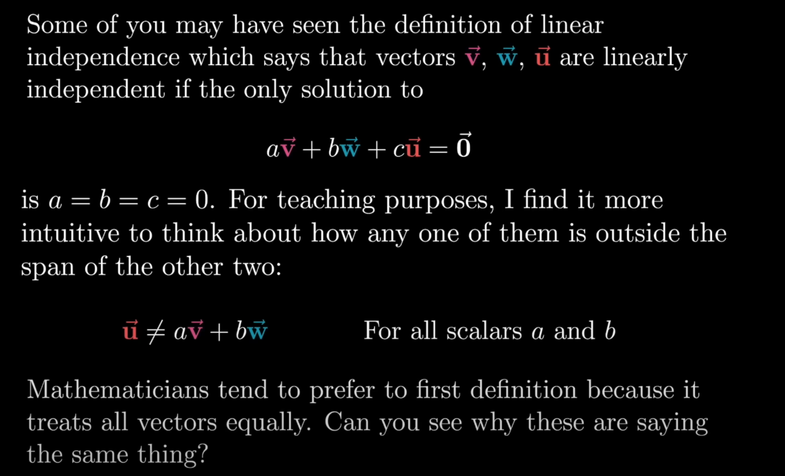
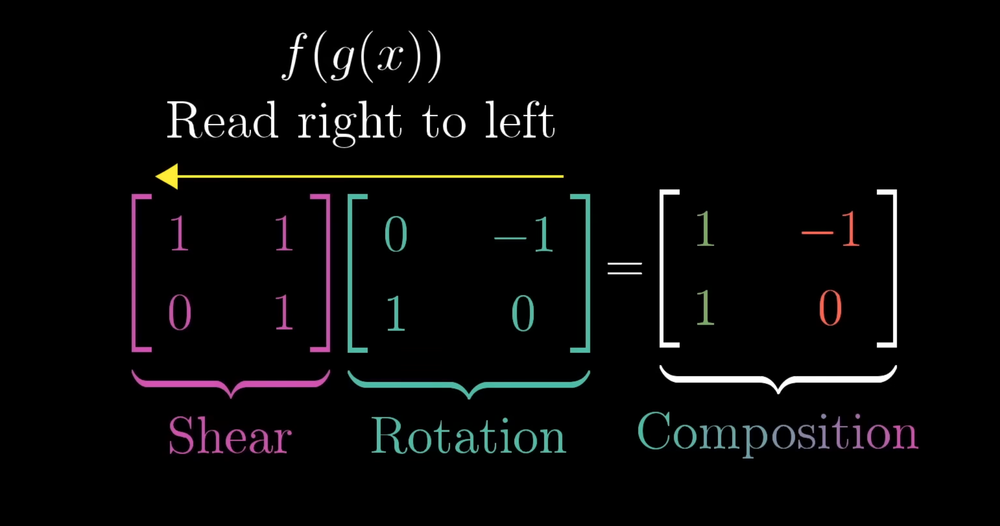

# Chapter 1

## Perspectives of Vectors
Physics: Magnitude + Direction
CS: Ordered lists of numbers
Mathmatician: more abstract
    * operations are important

* Coordinates:
  * are a pair of vectors that direct you how far to walk to get to a certain point

* Vector Operations: 
  * to add vectors we need to move the separate one, from the tip of the first one to the tail of the second one
  * when multiplying, we stretch/squish a vector and this is called scaling, we call nubmers that modify vectors as "scalar"

# Chapter 2
* When you have a pair of numbers, you need to think of each number as a scalar
* the basis vectors i hat x direciton, j hat y direction
* the vectors that coordinates describe are two scaled vectors 
* you can reach every possible two dimension vector using the basis vectors
  * you can change the basis vector and still usually represent the entoire space
  * the basis vectors determien 
* av + bw = linear combinartion of 2 vectors
* for most pairs of vectors, you can reach every possible two dimenions
* the "span" is the set of all possible vectors you can reach from a bcombination of 2 vectors is known as the span
  * the span of most 2d vectors, and when they line up, the span is just the vectors that sit on the line.
  * the span is aksing, whch vectors you can reach usuling scalar multiplicaiton and vector addition.
* Span is more interesting in 3d space,the span of 2 3d vectosr is all the posssible linear combinations you get by adding all of them tgother
  * this will trace out a flat sheet, the 2 vectors whose tips are respent this flat sheet
* now with 3d vectors, the span is the set of all possible linear combinations, and if the third vector doesn't sit on the span of hte first 2, we get access to very possible 3d vector
* v and w are linearly dependent, one u = av + bw means u is linearly depndent
  * if two vectors add another dimension to the span, they are said to be linearly independent u != av + bw
* the basis is a set of linearly independent vectors which span this space
* 

# Chapter 3: Linear Transformation and Matrices
* a transformation is a a fancy word for a function
* we take in a vector input and produce a vector output
* the term "transformation" is used ot indicate the input output relationship
* think of vectors as a point where each possible tip sits
  * for transformations we think of the point moving ot another space
* linear algebra limits transofmraitons to "linear" transformations
* all lines must remain as lines, the origin must remain fixed in space
* How to describe transformations numerically
  * we only need to record where the 2 basis vectors land and everyting else follows
  * we can deduce where any vector lands knowing where i hat and j hat land
  * linear transofmrations can be described by the 2 coordinates where i hat land, and the 2 coordinates wher ej hate lnand
  * you can then use a matrix for transformations to check for how scaling affects it
* vectors are represented as teh transformation of space

# Chapter 4: Matrix Multiplication as Composition:
* a matrix represents a set of linear transformations
* you sometimes want to affect theset of linear transformations
* new linear transformations is sometimes called the set of linear transformations
* to apply a rotation and then a shear
  * would be the same a a composition of the shear and rotation matrix together
  * 
* we can think of computing a product by multiplying two matrices together.
  * we read from right to left
    * 
    * the total effect of applying 2 transofmraitons gives us m1 and m2
      * we need to figure out where i hat go
* think of matrix multiplications as moving one vector and then another
  * does the order of the matrices matter?
    * left matrix tells us where i hat i sgoing to end
    * j hat is the right column and tells us where it ends
* Associativity = (AB)*C = A(BC)
  * there parenthesis doesn't matter
  * when you think of it as one transformation after another
  * the order in which you apply these transformations shouldn't matter

# Chapter 5: 3d dimensions
* consider a linear transformation in 3d for 2d 
* track grid in 3d vs 2d
  * every point in space is really just a proxy for a vector which has a tip at that points
  * its easier to track with the basis vector
  * record the coordinates as teh columns of a 3x3 matrix
  * break up tranformations as simpler transformations

# Chapter 6: The determinant
* if you think about linear transformations, we want to understand how much things are being stretched
* we care about the factor at which given areas increase or decrease
* if we focus attention on a one by one square, after the transformation, it scales to a 2 x 3
  * we can say the linear tranformation has scaled its area by a factor of 6
  * for a vector like [[1, 1], [0, 1]] the area is still the same
  * if we know how much one unit square canges, we can figure out how the area of all other squares in the grid change
    * this is based on grid lines remain parallel and eve squared
    * you can get a good enough approximation for an area if you use small enough squares
  * this scaling factor is known as the determinant of the transforamtion
    * determinant of a transofmration if it squishes the entire space onto a line or a point
      * this will give a way of computing if the transfomration squishes everything into a singular dimension
  * full concept of a determinant allows for negative values, this has to do with orientation
    * negative determinant indicates the inveresion of the orientation of space
    * whenever the orientation of space is inverted the determinant will be negative
    * as i hat gets closer to jhat, the determinant approaches 0, once i hat perfectly gets close to jhat the determinant is 0
  * the square gives you everything you need
    * after a transofmraiton a cube gets warped
      * the determinant is the volume of the parallel piped
        * this means the columns are linearly dependent
      * the right hand rule is good for giving you the direction of the orientation
  * To calculate a determinant, [[a, b], [c, d]] -> ab - bc, we basically see how much our thingy stretches
  * if both b and c are nonzero, we figure out how much is stretches in the diagnol distances
* there is a formula for 3d dets:
  * 