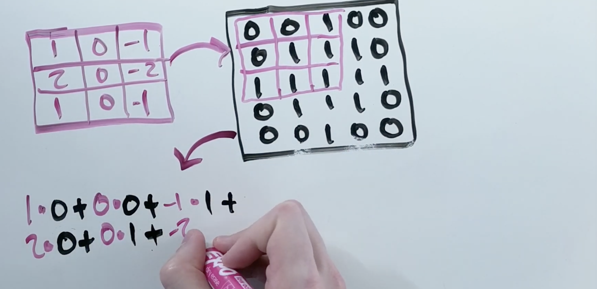
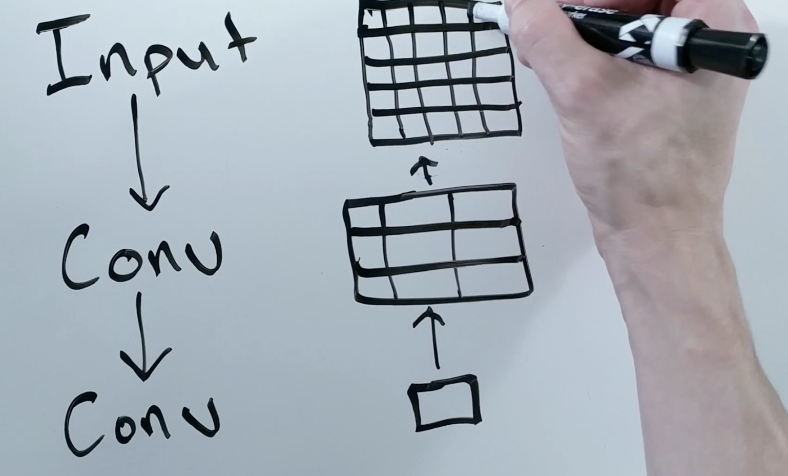

# CNNs

* designed for data that is spatially related
* each input is related in someway to the inputs next to it
* images are the main layer
  
## Convolutional Layer
* core unit is the convolutional layer
* layers train fitlers to understand relationship between data
* edge layer is the output filter
* for every position:
  * new poistion = filter * position
  * 
* Convolutional layers usually have many filters
  * say we have a 100 filters
  * we get a 100 matrices as the output
  * filters are usually 3x3 or 5x5
  * we stack more convolutional layers 
    * each layer is upposed to get more and more features
  * pixels are closer together tend to be closer related
  * they are useful aynwhere where data is spatially related

## What is a receptive field:
* Combining small portions into features
  * looking at last llayer and combining it into features
* the receptive field is the required layer 

* there is a formula to calculate teh size of a given layer
* Pooling and architecture changes increase the size of the receptive field
* we can shape the receptive field by 0ing out parts of the layer
* receptive field is the portion of the input needed to create the current feature we are looking at in a convolution layer.
