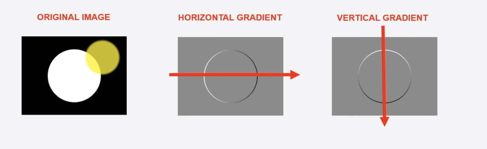

# Histogram of Oriented Gradients

## Basics
* 
* a positive gradient is a change in intensity in the original image
* as we move forward
* we need to represent the couple of pixels around the image ina  compact representation
* we are essentially removing all the uncessary information from say a 64 values to like 9 values
* this is to represent the image
* the pixel under consideration, we take the pixels around it
  * to calculate the gradient 
  * 
  * we can find out all these details