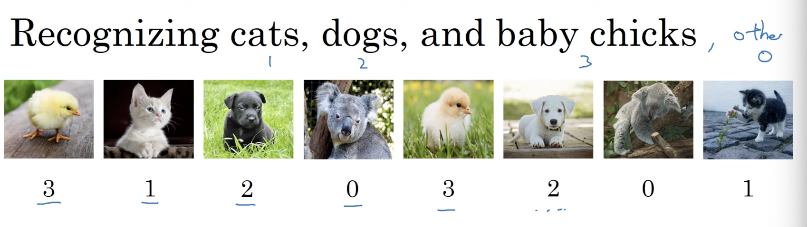
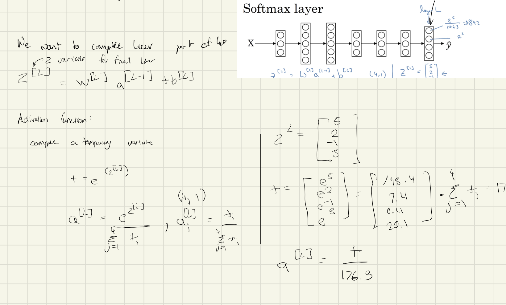
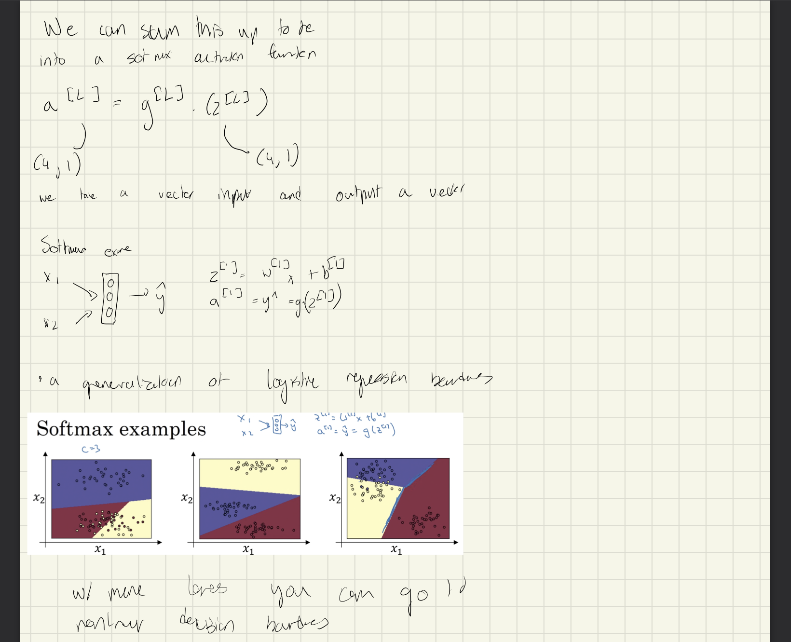
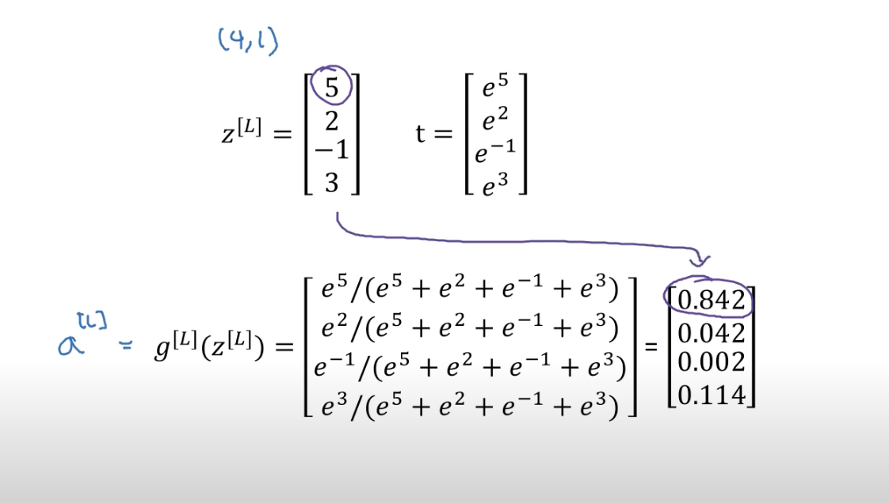
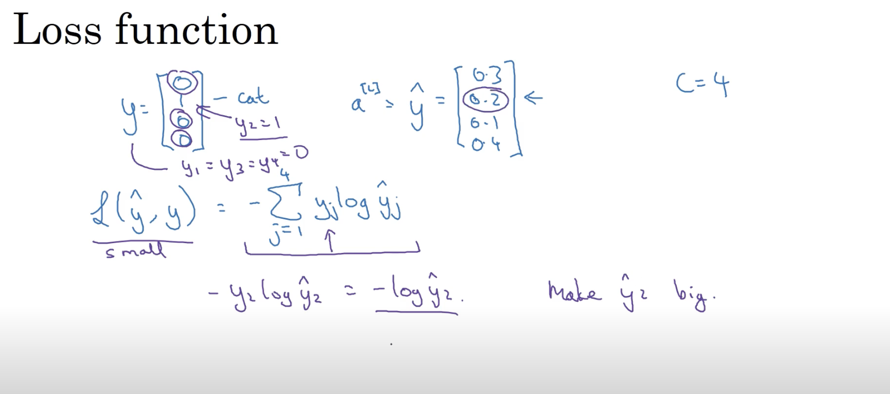
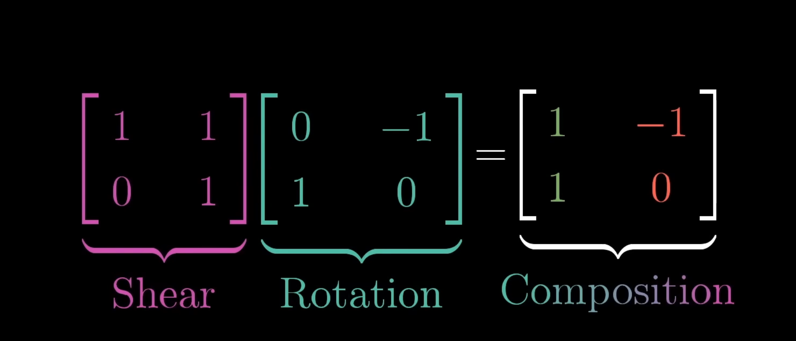

# What is a classifier
* a generalization of regression that helps us detect one of multiple classes. Say we want to detect one of cats, dogs, or babychicks.
ex:
Detecting Cats, Dogs, BabyChicks

C = # classes (0..3)
We want the output layer to tell us the probability of each layer.
P(Other | x)
P(cat | x)
P(dog | x)
P(bc | x) //bc = babychick
probabilities should sum to 1

### training soft max classifier

Hard max is like
[1 0 0 0]
Where its a max value
soft max is a probability distribution

called softmax in contrast to the hard max
* if we output the softmax
* if c = 2 softmax reduces to logistic regiression, we can just use one variable to calculat ethe second one

We basically want to use gradient descent to minimize our loss

number of classes by the number of examples
Our data would be a (c, n)

Gradient descent with a softmax allows to compute the loss
Backprop: we need to initialze a derivative with respect to the loss layer.

Backprop: dz[l] = y^ - y

dz is a partial derivative with respect to the variable z
we can then compute the dzl and compute the back propogation of all the previous 
